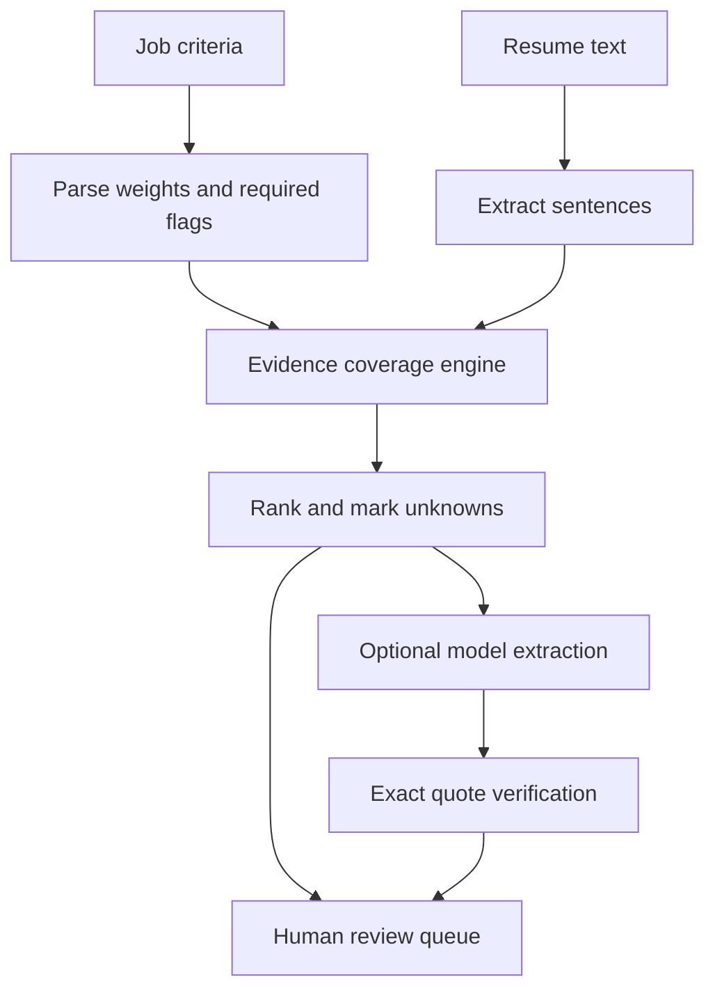

# Signal Review

An evidence-linked first pass for high-volume hiring queues. Recruiters define weighted job criteria, evaluate thousands of applications, and inspect exact résumé passages before deciding what to review. Missing evidence is **unknown**, not absence of ability. The system does not make hiring or rejection decisions.

[Live synthetic demo](https://signal-review.netlify.app/) · [Portfolio case study](https://thenorth.dev/projects/signal-review/)

## What runs where

| Path | Source data | Scoring | AI | Persistence |
| --- | --- | --- | --- | --- |
| Hosted demo | 3,518 seeded fictional profiles; optional local CSV | Browser Web Worker, deterministic evidence coverage | None | Tab memory only |
| Local batch CLI | `.txt`, `.pdf`, `.docx` résumé folder | Python/SQLite ingestion, deterministic evidence coverage | Optional structured extraction for the top N only | Local SQLite and JSON run report |

The live counter measures the browser evaluation pass, **not** parsing, model latency, network, sourcing, human review, or end-to-end throughput. It makes no claim to match a vendor's model pricing or review quality.

## Run the hosted workbench locally

```bash
npm install
npm run dev
npm test
npm run build
node --experimental-strip-types tests/bench.mjs
```

The browser app lets you change required criteria (`!`), weights (`| 1–5`), import a CSV with `id,name,text,location`, run a worker, inspect every criterion quote, and search the queue. Imported text never leaves the tab. The 3,518 synthetic profiles are deliberately repetitive so UI and throughput can be exercised; they are **not** an evaluation dataset for matching quality or fairness.

## Run a real local batch

```bash
python3 -m venv .venv
. .venv/bin/activate
pip install -r service/requirements.txt
python3 service/review.py ./resumes ./rubric.txt --db ./review.db --output ./run.json
python3 -m unittest discover -s tests -p 'test_*.py'
```

`rubric.txt` example:

```text
!TypeScript | 3
!React | 3
Python | 2
Customer discovery | 2
Testing | 1
```

Text extraction failures are counted and shown; scanned PDFs require OCR before ingestion. Filenames become local IDs via hashing; raw content and its SHA-256 digest are held in SQLite. The run report records the rubric, source digest, exact evidence, score, and stable tie breaks. Keep the input folder and SQLite database access controlled; the app does not implement authentication or retention policy.

### Optional model-assisted evidence extraction

Set `OPENAI_API_KEY` and pass `--model MODEL_NAME --model-limit 20`. This explicitly sends the top 20 local résumé texts to the API. The structured output must give an exact quote per criterion. A quote that is absent from the source becomes **unknown**. The model does not get authority to reject people; its results replace only the top N evidence annotations and the score is recalculated from verified quotes. It is **off by default**, not used on the hosted site, and has not been benchmarked against a provider in this repository. Read the provider's data handling terms before processing real applicant data.

## Architecture



The local model path performs reranking only on a bounded subset. This saves model calls, but a lexical first pass can miss strong candidates whose wording differs from the configured phrases. For a production system, add recall evaluation, a calibrated retrieval layer, multi-source provenance, human overrides, access controls, retention limits, bias monitoring, and documented appeals. Do not use these scores as a sole basis for employment decisions.

## Deliberate boundaries

- A `75%` score is rubric coverage, not a probability or suitability rating. It changes when the rubric changes.
- Positive phrases are matched with word boundaries and limited negation handling. It can miss paraphrases or misread complex language. The optional model addresses some phrasing but still needs evaluation.
- Candidate names and locations are displayed for navigation, not used by the scoring engine. Protected traits should never be added as criteria.
- CSV import is browser-local and does not parse PDF/DOCX; the local CLI handles those formats.
- The UI has no account system, multi-reviewer workflow, ATS integration, or production-grade audit governance. The Python run ledger is a technical audit of evidence, not regulatory compliance.

## Verification

`npm test` covers evidence grounding, negation, missing required data, rubric validation, deterministic ordering, and quoted CSV. `python3 -m unittest discover -s tests -p 'test_*.py'` covers local batch persistence and rejects fabricated model quotes. Run the benchmark on your machine with the command above; its output reports the actual local elapsed time and profiles per second and excludes generation/UI/network/model calls.

Built by Harshdeep Singh. Fictional applications and distinct visual design; the linked reference video inspired the problem, not the output data or benchmark.
